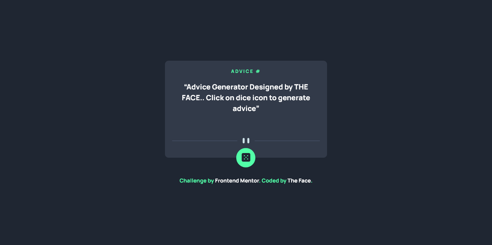

# Frontend Mentor - Advice generator app solution

This is my solution to the [Advice generator app challenge on Frontend Mentor](https://www.frontendmentor.io/challenges/advice-generator-app-QdUG-13db).

### Screenshot

### Links

- Solution URL: [Check solution]()
- Live Site URL: [Visit live site](https://thefaceadvice.vercel.app)

### Built with

- Semantic HTML5 markup
- CSS custom properties
- JavaScript

## Author

- Website - [Ezekiel The Face](https://thefaceportfolio.netlify.app)
- Frontend Mentor - [@iamtheface](https://www.frontendmentor.io/profile/iamtheface)
- Twitter - [@thefacetweets](https://www.twitter.com/thefacetweets)
